# Aquamarine Aardvarks WebApp

## A Brief Introduction
Welcome to the Travel blogging website created by team Aquamarine Aardvarks.

There are 4 members in our team: Ziek, Kinzi, Yaping and Fiona. We all work full-time and live in New Zealand, with two of our team members located on the South Island and the two others on the North Island. We share a love for travelling, delicious food and wine, so we decided to create a blogging site dedicated to travellers who want to share their experiences about the place they visited, the food they tasted and/or the events they went to when travelling. Team Aquamarine Aardvarks was created by Andrew Meads only 2 weeks ago and we are very proud of the website we have managed to create in the span of those two weeks. Thank you for your hard work team!

## Compulsory Feature Implementation
1. Users can create a new account by clicking on the sign-up button in the navbar. They get redirected to the new account form, where they get prompted to choose a username and a password. The user must also enter their first and last name, date of birth, a brief description of themselves and an avatar.

2. If the user chooses a username that is already in use, they get prompted to choose a different one and the form is unable to be submitted until they pick a unique username.

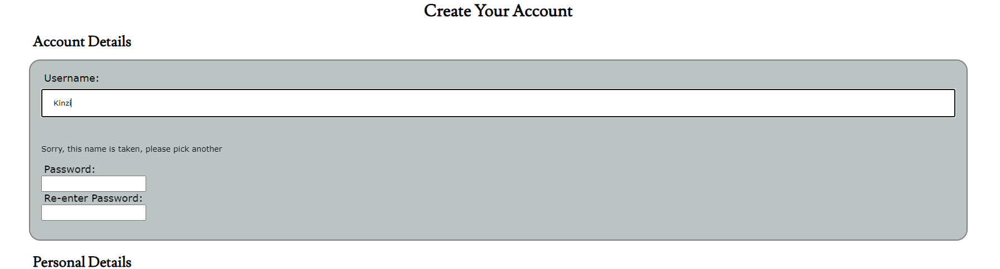

3. When selecting a password while creating an account, users are presented with two password textboxes. They must type the same password in each box to proceed. If the user does not enter the same password in both text boxes, a prompt saying that the passwords do not match will appear and the user will not be able to submit the form.

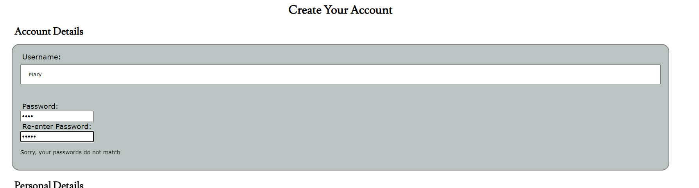

4. When creating an account, users can also choose from a set of ten predefined “avatar” icons to represent themselves.

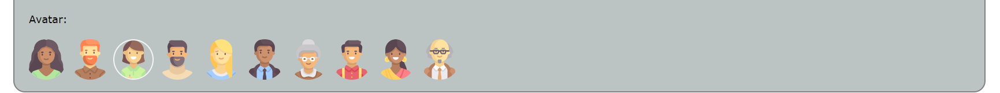

5. Once a user has created an account, they can log in and log out by clicking the relevant button on the navbar.

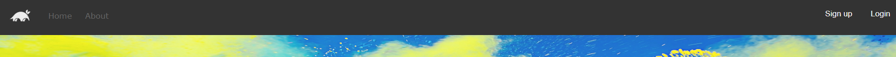
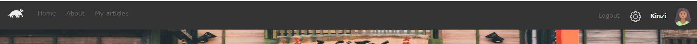

6. All passwords are stored in their hashed and salted form in our database.
7. Users can browse a list of all articles, regardless of whether they are logged in or not. When logged in, they are also able to browse a list of their own articles on their My Articles page.

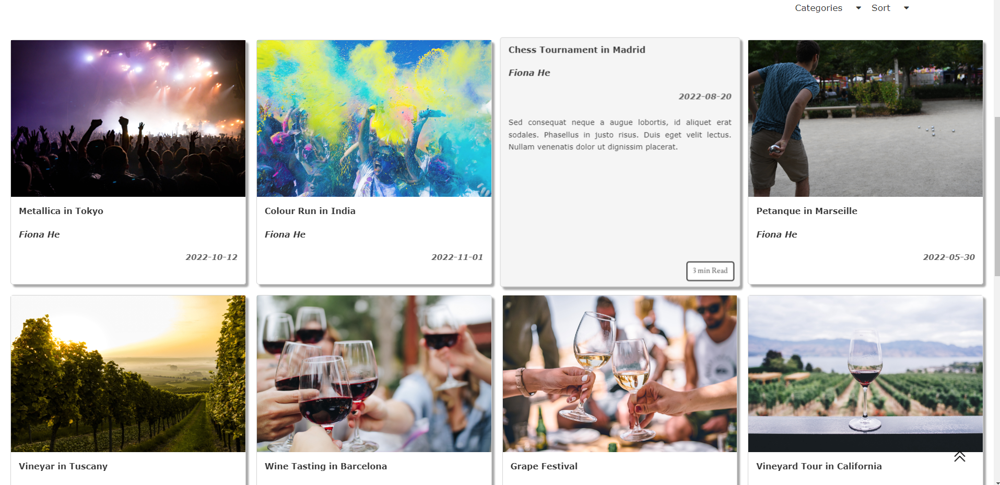

8. When logged in, users can also add new articles, and edit or delete existing articles they have authored.
9. Users write articles through a TinyMCE text editor. They can upload images anywhere in the body or their article resize and position them. Those images are stored as files on the server. Please note that when uploading an image through the TinyMCE editor an error message will show but the image gets uploaded and stored appropriately regardless.

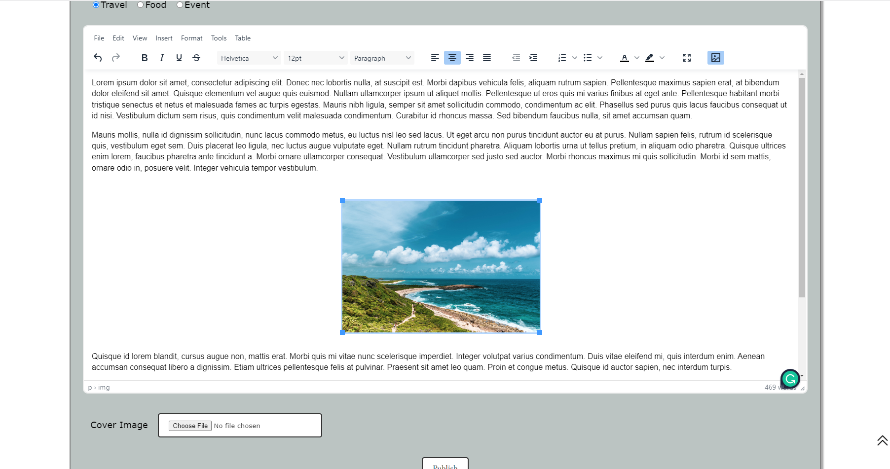

10. Users can edit any of their account information and delete their account by clicking on the wheel icon in the navbar. When a user deletes their account, all their articles are also permanently deleted.

11. We applied a consistent colour scheme for both our light and dark modes with 3 main colours. We also used the same fonts, buttons, and form styles across the site to ensure it has a consistent look and feel. The website was built to be responsive through the use of flex, grid displays and @media.

 
 ## Extra Feature Implementation

1.    Navbar
The Navbar is a consistent function for all pages. 
When not login as a user, the Navbar is showing a Logo of Aardvark, “Home” and “About” tabs will direct to the respective pages. The “Sign up” and “Login” buttons are on the right-hand side. By clicking the “Sign up” button it will redirect to /newAccount page for creating new accounts and clicking the “Login” button will redirect to /login page for existing account login.
 
When login in as a user, apart from the “logo”, “Home” and “About” tabs, an extra “My articles” tab will be shown, and it redirects to /profile page which displays all articles that have been published by this user. Instead of “Sign up” and “Login” buttons on the right-hand side, the “Logout” tab, the setting icon and username as well as the avatar will be displayed. By clicking the “Logout” tab, it will log the user out and redirect back to the home page. Clicking the setting icon, it redirects to /settings page for the user to change settings of dark/light mode of the webpage colour and update account information, change password and delete the existing account. The username and avatar are also clickable, both are redirecting to /profile page.
 
All the tabs in the Navbar can change colour when hovering over.

2.    Back home Aardvark logo link in navbar
By clicking the logo icon of Aardvark left corner on the navbar, it can redirect to the home page from anywhere within this website.

3.    About page
It is an extra page we have for an introduction of this website. It is a clickable tab on the Navbar and able to be accessed by existing users and non-user.

4.    Featured article
It randomly displays an existing article on the top of the home page with a big size picture. It will be changed every time when the home page refreshes. The title, author and description of this particular article are shown in the picture. By clicking any place on this featured article picture, it will redirect to the given article correspondingly. 

5.    Days since published function for the Featured article
A date count feature was also implemented on top of the Featured article. It shows how many days since this article has been published, 

6.    Preview card display for articles
Below the featured article, all the articles published on this website will be displayed as preview cards. On the front of the card, it shows the title, author and publish date of the article. 

7.    Card animation on hover
When hovering over those cards, it flips the card over showing again the title, author and description plus an estimated reading time.

8.    Reading time of article
This is shown both on the preview cards and actual article page. It estimated the reading time by counting and calculating the number of words within the article content.

9.    Sort articles by Category 
All articles preview cards can be sorted and displayed by category of all/travel/food/event. There are two drop down sorting boxes on the right hand side between featured article and preview cards. 

 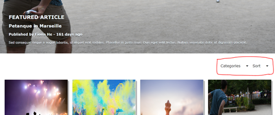

10.    Sort articles by date published 
All article preview cards can be sorted and displayed by the date published from the latest or the oldest. 

11.    Back to top button appears on scroll
When scrolling down the page, once the Navbar is no longer visible, there is a sticky “back to top” button that will pop-up on the right bottom corner and by clicking it, it takes you back to the top of the page. The colour of this button will be changed slightly when hovering over. This function is also consistent throughout all pages on this website.
 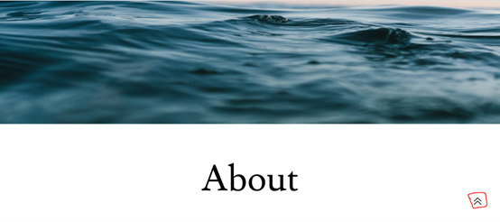
 

12.    Dark and Light mode
The website operates as standard light mode as default setting for user and non-user. 
Once the user has been logged in, under /settings page there is a function that is able to toggle the webpage colour between light/dark mode. By clicking the sun/moon icon, which is also indicated by the wording just below the icon.
 
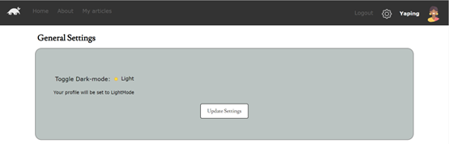
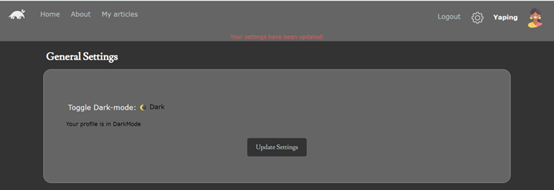

13.    Change Avatar display in settings 
Once they login as a user, the user can choose to change their account information including details of username, full name, date of birth and description. More add on to those, when hovering over the avatar image, there will be a clickable button. Once “Changing Avatar?” button is clicked, a popping model feature can be used to change avatar.
 
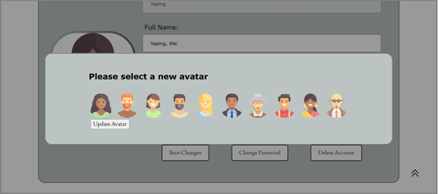

14.    Are you sure? Modal display before deleting account
When the user tries to delete their account by clicking the “Delete Account” button on the /settings page, a model will pop out to ask if the user intends to delete the account permanently. 

 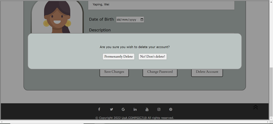
 
15.    Comment section 
This function is only visible and accessible for logged in users. When the user logged in, a comment section will be shown below the article content in each article page. The user will be able to place a comment and submit it by clicking the “Submit Comment” button. The comment will remain in this article once it has been submitted. The previous comments put by other users will also be available to be seen.

 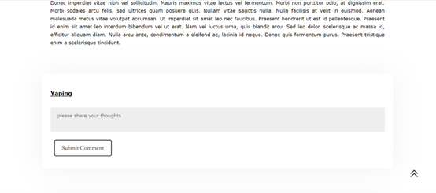
 
16.    Footer
The footer is displayed on the bottom of all pages, with the clickable icon links to the social media homepage. Copyright is linked to COMPSCI 719 Canvas login page.
 
 

## Setting up the Database

We kept the original db name so the database should be initialised with the name “**project-database.db**”. We also added all the packages required to the package.json file, so a simple npm install will add all the required functionality.

## Setting up the initial user data.

Once the database is set up and the packages have been installed. The marker will need to open the database in DB Browser for SQLite and run the sql file named “**project-database-init-script**” that is included in the directory.

## Initial Access

The marker can log into the site using any of the below username and password combinations,

 ### 1. USERNAME / PASSWORD
2. Fiona / fiona
3. Yaping / yaping
4. Ziek / ziek
5. Kinzi / aardvarks